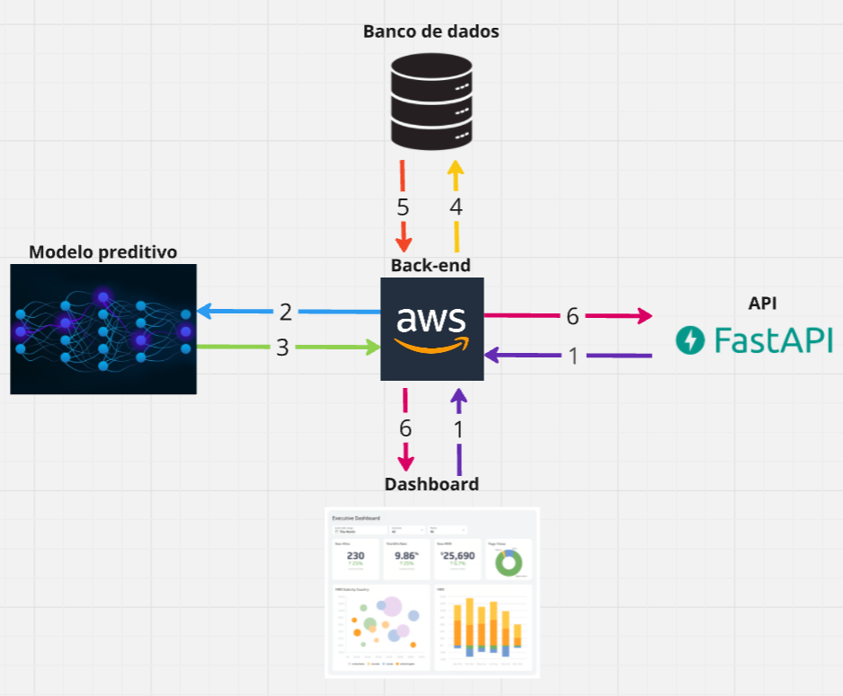

# Proposta geral do sistema

&emsp; De acordo com as reuniões que fizemos com o cliente, interpretamos a dor do parceiro como: 

"Atualmente, a maneira de assegurar que um carro produzido não possui falhas é fazendo as verificações de qualidade e os testes externos em todos os carros produzidos, o que demanda muito tempo de produção."

&emsp; Para sanarmos a problemática apresentada o grupo Presgen propõe, um sistema em nuvem com um modelo de inteligência artificial para fazer as predições, um dashboard fazer predições e visualizar o histórico de previsõe e, por fim, uma API a qual permita fazer as mesmas consultas que o dashboard. O diagrama a seguir representa os elementos que compõem o sistema e as conexões entre eles e está sujeito a alterações conforme as necessidades do cliente:

  
  
Diagrama da arquitetura da solução proposta

## Elementos do sistema:

- `Dashboard:` elemento interativo que tem como propósito permitir a entrada de dados para o modelo de maneira fácil e intuitiva. Adicionalmente, inclui um histórico de predições para a consulta facilitada das entradas e saídas prévias do modelo.

- `Modelo de Inteligência Artificial`: elemento que utiliza treina com dados conhecidos para encontrar padrões e regular-se para predizer resultados com base nos padrões aprendidos durante a sessão de treino.

- `Banco de dados`: elemento responsável por armazenar as consultas feitas pelos usuários de maneira organizada.
  
- `Back-end`: elemento encarregado de processar as informações recebidas pelo sistema e comunicar as informações necessárias entre os diferentes elementos.

- `API`: elemento é uma interface de comunicação entre o cliente (usuário) e o servidor (back-end) simplificada, comunicando-se por requisições.

## Conexões entre os elementos:

&emsp; 1. `Requisição HTTP POST`: protocolo de comunicação web que conecta um pedido do cliente com o servidor e aguarda a resposta. Esta requisição tem como objetivo enviar os dados que o cliente utilizará na previsão para o servidor.

&emsp; 2. `Entrada de dados no modelo`: método pertencente ao modelo para produzir uma previsão utilizando os dados enviados pelo cliente.

&emsp; 3. `Saída de dados no modelo`: método que retorna o valor previsto pelo modelo ao adicionar os dados de entrada.

&emsp; 4. `Escrita das informações no banco de dados`: declaração em SQL que registra os dados enviados pelo cliente e o resultado previsto pelo modelo no banco de dados

&emsp; 5. `Leitura das informações no banco de dados`: declaração em SQL que lê os dados cadastrados no banco de dados.

&emsp; 6. `Resposta do servidor par o cliente`: retorno do protocolo de comunicação web, possui como informação os últimos dados inseridos no banco de dados.