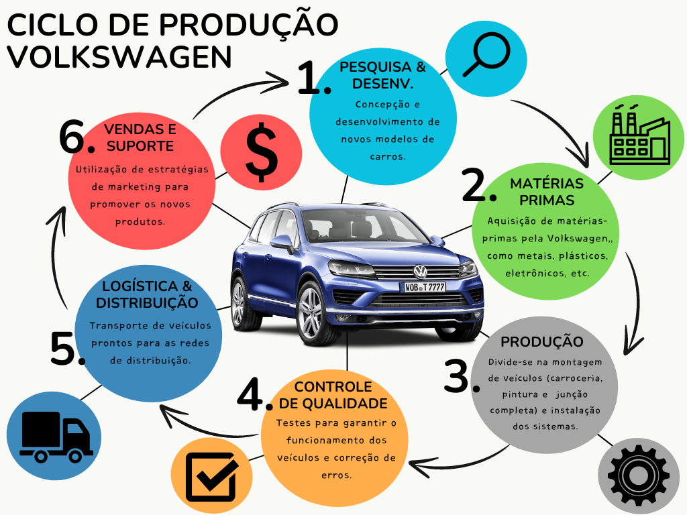

# Economia Circular

A economia circular é um conceito que busca minimizar o desperdício e promover a sustentabilidade através da reutilização, reciclagem e regeneração de recursos. Ao contrário do modelo linear tradicional de produção e consumo, onde os recursos são extraídos, transformados em produtos e descartados, a economia circular propõe um ciclo contínuo de uso e reutilização dos materiais. [1]

Nesse modelo, os produtos são projetados para serem duráveis, reparáveis e recicláveis, de forma a prolongar sua vida útil e reduzir a necessidade de extração de novos recursos. Além disso, a economia circular incentiva a criação de sistemas de logística reversa, onde os produtos são coletados após o uso e encaminhados para reciclagem ou reutilização.

A implementação da economia circular traz diversos benefícios, tanto ambientais quanto econômicos. Reduz a emissão de gases de efeito estufa, diminui a dependência de recursos naturais finitos, gera empregos na área de reciclagem e promove a inovação tecnológica.

No projeto, a economia circular é aplicada pela Volkswagen através da redução de dióxido de carbono (CO2) com o auxílio do programa _Aluminum Closed Loop_, que visa a reciclagem de alumínio para a produção de novos veículos, sendo este um material leve e resistente, o processamento de ferramentas para que sejam reutilizadas, como moldes, matrizes, dispositivos de fixação e outros equipamentos da fabricão de veículos, e a reciclagem dos materiais durante o desenvolvimento de novos automóveis, com materiais reciclados de alta qualidade, evitando poluentes. [2]

## Acesso e visualização de dados

No projeto, os dados serão acessados através de APIs realizadas pelos integrantes do grupo Presgen, que fornecem informações sobre a produção, logística e sustentabilidade da empresa. Esses dados serão utilizados para criar visualizações interativas que permitam aos usuários explorar e compreender melhor o ciclo de produção da Volkswagen e seus impactos ambientais e sociais.

## Matérias-Primas e Recursos [2]

### 1. **Matérias-Primas**
- **Metais:** A Volkswagen utiliza metais como alumínio, aço, cobre, e metais preciosos (como platina) na fabricação de veículos. Para veículos elétricos, materiais como lítio, cobalto, níquel e manganês são cruciais para a produção de baterias.
- **Plásticos e Polímeros:** Usados em várias partes dos veículos, desde o interior até componentes externos.
- **Vidro:** Utilizado em janelas, para-brisas e displays de veículos.
- **Têxteis e Couro:** Para acabamentos internos e estofados.

### 2. **Recursos Energéticos**
- **Energia Elétrica e Térmica:** Utilizada nas fábricas para o processo de fabricação.
- **Água:** Necessária em processos de resfriamento e na pintura de veículos.

## Ciclo de Produção da Volkswagen [4]

Fonte: Elaboração própria.

O ciclo de produção da Volkswagen envolve várias etapas e divisões específicas para garantir a fabricação eficiente de veículos. Este ciclo pode ser descrito de maneira abrangente, cobrindo desde o desenvolvimento inicial até a entrega do veículo final. As principais divisões da Volkswagen que desempenham um papel essencial neste ciclo incluem Pesquisa e Desenvolvimento (P&D), Produção, Logística, Qualidade e Vendas.

### 1. **Pesquisa e Desenvolvimento (P&D)**
   - **Projeto e Engenharia:** Esta fase envolve a concepção e o desenvolvimento de novos modelos de veículos, incluindo design, prototipagem e testes. As equipes de engenharia trabalham em estreita colaboração com os departamentos de design para garantir que os veículos atendam aos padrões de segurança, eficiência e estilo da marca.
   - **Inovação Tecnológica:** Desenvolvimento de novas tecnologias, como sistemas de assistência ao motorista, propulsão elétrica, e soluções de conectividade.

### 2. **Aquisição de Matérias-Primas e Componentes**
   - **Suprimentos e Logística:** A Volkswagen adquire matérias-primas e componentes de uma vasta rede de fornecedores globais. Isso inclui metais, plásticos, eletrônicos, e outros materiais essenciais para a produção de veículos.
   - **Sustentabilidade na Cadeia de Suprimentos:** A empresa implementa rigorosos padrões de sustentabilidade e responsabilidade social em sua cadeia de suprimentos para garantir a conformidade com as normas ambientais e de direitos humanos.

### 3. **Produção**
   - **Montagem de Veículos:** A produção começa com a fabricação de carrocerias, seguida pela pintura e montagem final. Linhas de produção automatizadas são usadas para montar componentes mecânicos, elétricos e eletrônicos no veículo.
   - **Instalação de Sistemas:** Integração de motores, sistemas de transmissão, sistemas de infotainment, e outros componentes essenciais. A produção de baterias para veículos elétricos também faz parte desta fase.

### 4. **Controle de Qualidade**
   - **Inspeções e Testes:** Cada veículo passa por rigorosos testes de qualidade para garantir que todos os sistemas funcionem corretamente e que o veículo atenda aos padrões de segurança e desempenho da Volkswagen.
   - **Ajustes e Correções:** Se forem detectadas falhas ou defeitos, ajustes são feitos para corrigir quaisquer problemas antes que o veículo seja liberado para o mercado.

### 5. **Logística e Distribuição**
   - **Transporte de Veículos:** Os veículos prontos são transportados das fábricas para os centros de distribuição e concessionárias ao redor do mundo.
   - **Gerenciamento de Inventário:** Sistemas de gerenciamento de inventário são utilizados para otimizar a entrega dos veículos e garantir que os clientes recebam seus pedidos no menor tempo possível.

### 6. **Vendas e Suporte ao Cliente**
   - **Marketing e Vendas:** A Volkswagen utiliza estratégias de marketing para promover seus veículos e atrair clientes. Concessionárias e vendas online desempenham um papel crucial na distribuição dos veículos.
   - **Serviço Pós-Venda:** Suporte ao cliente, incluindo manutenção, reparos e serviços de garantia, é fornecido para garantir a satisfação contínua dos clientes com seus veículos Volkswagen.

## Impactos Sociais e Ambientais [5]

### 1. **Impactos Ambientais**
- **Emissões de Carbono:** A produção e logística contribuem significativamente para as emissões de CO2, um ponto que a Volkswagen busca mitigar com eficiência energética e energia renovável.
- **Poluição da Água e Solo:** Devido a resíduos industriais e uso de produtos químicos na fabricação.
- **Consumo de Recursos Naturais:** Extração de matérias-primas impacta ecossistemas e comunidades locais, especialmente em mineração de metais.

### 2. **Impactos Sociais**
- **Direitos Humanos:** A Volkswagen enfrenta desafios em garantir que a extração de matérias-primas respeite os direitos humanos, especialmente em regiões de mineração de alto risco.
- **Condições de Trabalho:** A empresa está focada em melhorar as condições de trabalho ao longo da sua cadeia de suprimentos, com auditorias e programas de desenvolvimento de fornecedores.

## Utilização, Reutilização e Reciclagem [3]

### 1. **Utilização**
- **Eficiência Energética:** Carros elétricos e combustíveis alternativos estão sendo promovidos para reduzir o impacto ambiental durante a utilização dos veículos.

### 2. **Reutilização**
- **Peças Recondicionadas:** A Volkswagen explora a reutilização de componentes, como motores e peças de suspensão, para reduzir o desperdício.

### 3. **Reciclagem**
- **Reciclagem de Baterias:** A reciclagem de baterias de íons de lítio é crítica devido à presença de metais valiosos e ao impacto ambiental de resíduos perigosos.
- **Reciclagem de Metais e Plásticos:** O aço e o alumínio são altamente recicláveis, e a Volkswagen tem programas para melhorar as taxas de reciclagem de plásticos.

## Descarte [5]

### 1. **Descarte Adequado**
- **Infraestrutura de Reciclagem:** A Volkswagen investe em infraestrutura para garantir o descarte adequado de veículos fora de uso, incluindo a reciclagem de materiais perigosos como baterias e fluidos.

### 2. **Possibilidades Inadequadas**
- **Despejo Ilegal:** Riscos associados ao descarte inadequado incluem a poluição de solos e águas devido a componentes tóxicos.
- **Desperdício de Recursos:** Falta de reciclagem pode levar ao desperdício de materiais valiosos e aumento de resíduos em aterros.

## Referências

[1] What is circular economy?. Disponível em: https://www.ellenmacarthurfoundation.org/topics/circular-economy-introduction/overview.  
[2] Group sustainability report 2023. Disponível em: https://www.volkswagen-group.com/en/publications/more/group-sustainability-report-2023-2674.  
[3] Volkswagen Goup - Sustainability. Disponível em: https://www.volkswagen-group.com/en/sustainability-15772.  
[4] Volkswagen Group - Group management report (Production). Disponível em: https://annualreport2023.volkswagen-group.com/group-management-report/sustainable-value-enhancement/production.html.  
[5] Volkswagen strengthens its rules to ensure sustainable, socially compatible raw material procuremen. Disponível: https://www.volkswagen-group.com/en/press-releases/volkswagen-strengthens-its-rules-to-ensure-sustainable-socially-compatible-raw-material-procurement-16386.
